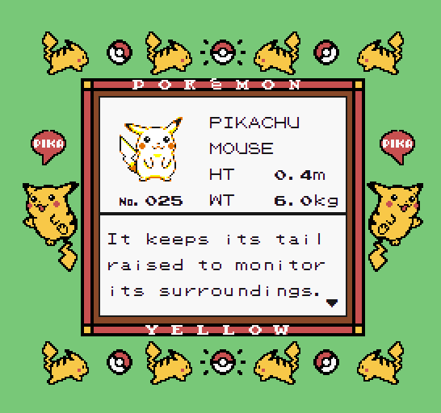

# Portfólio de Guilherme Moisés Rodrigues Garcia

.

Acesso: https://elc1090.github.io/project2-Alexandre-ChagasBrites/

#### Desenvolvedor(a)

Alexandre Chagas Brites

#### Tecnologias

- HTML
- CSS
- PokéAPI

#### Ambiente de desenvolvimento

- VS Code

#### Créditos

- https://www.spriters-resource.com/ (Sprites)

---
Projeto entregue para a disciplina de [Desenvolvimento de Software para a Web](http://github.com/andreainfufsm/elc1090-2023a) em 2023a